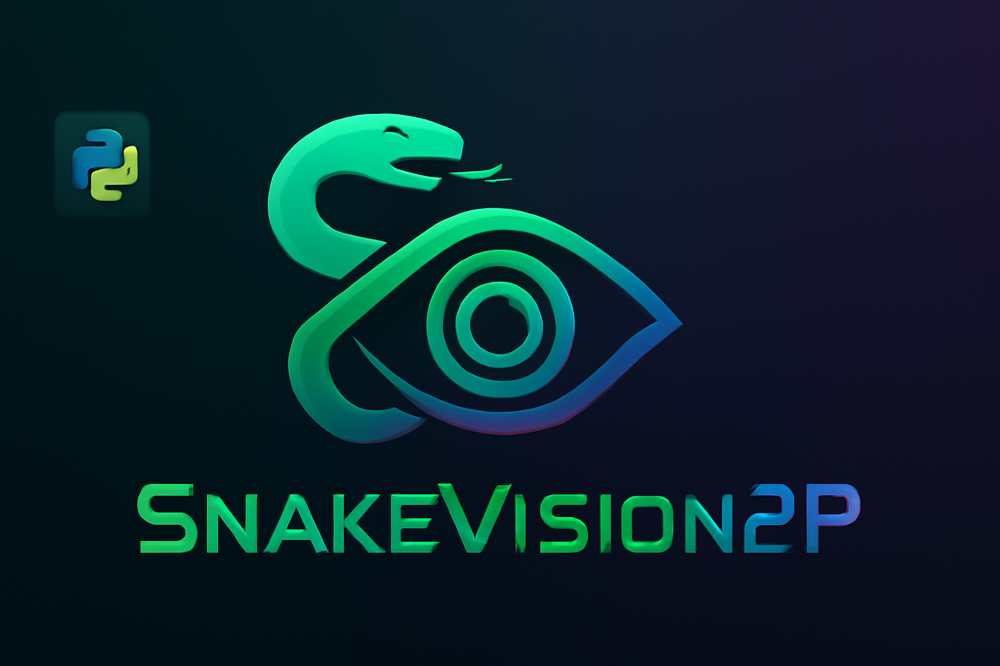

# 🐍 SnakeVision2P

  <!-- Optional banner image -->

## 🎮 Deskripsi
SnakeVision2P adalah game ular multiplayer yang unik, dikendalikan dengan **kamera menggunakan teknologi object tracking**.  
Dua pemain dapat bersaing secara real-time menggunakan gerakan tubuh yang dideteksi kamera untuk mengontrol ular masing-masing.


## 🔍 Teknologi Utama
- **Object Tracking via Camera** untuk kontrol game tanpa joystick atau keyboard  
- Multi-threaded control untuk responsivitas tinggi  
- Suara dan grafis interaktif untuk pengalaman bermain yang menyenangkan  
- Game 2 pemain dalam satu layar dengan mekanisme kompetitif  

## 🚀 Cara Memulai

1. Clone repo:

   ```bash
   git clone https://github.com/username/SnakeVision2P.git
   cd SnakeVision2P
    ```

2. Persiapkan Python 3.x dan virtual environment:

   ```bash
   python -m venv venv
   source venv/bin/activate  # Linux/macOS
   venv\Scripts\activate     # Windows
   ```

3. Instal dependencies:

   ```bash
   pip install -r requirements.txt
   ```

4. Jalankan game:

   ```bash
   python main.py

   or

   python UDPmain.py
   ```


## 🕹️ Kontrol

* Gerakan tubuh atau objek tertentu di depan kamera akan mengontrol arah ular masing-masing pemain.
* Setiap pemain menggunakan area kamera yang berbeda untuk input gerakan.


## 🎵 Fitur Audio & Grafis

* Musik latar dan efek suara saat memakan buah atau saat game over
* Gambar buah berwarna-warni sebagai target ular


## 📂 Struktur Folder

```
SnakeVision2P/
├── assets/                 
│   ├── apple.png
│   ├── bg_music.wav
│   ├── die.mp3
│   ├── eat.wav
│   ├── grape.png
│   ├── Banner_Generated_byChatGPT.png
│   └── strawberry.png
├── SnakeVision2P.py
├── UDPmain.py
├── UDPcontroller.py 
├── UDPSnakeGame2Player.py        
├── game-control-using-object-tracking-multithreaded-2players.py 
├── requirements.txt
└── main.py                 
```

<h2 align="center">🤝 Kontribusi</h2>

<p align="center">
  <em>Kami sangat terbuka untuk kontribusi!
Silakan buat pull request atau laporkan isu.</em>
</p>

---


<p align="center">
  <em>Developed with ❤️ by Data Science Telkom University Surabaya</em>
</p>